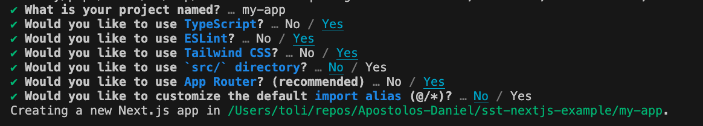
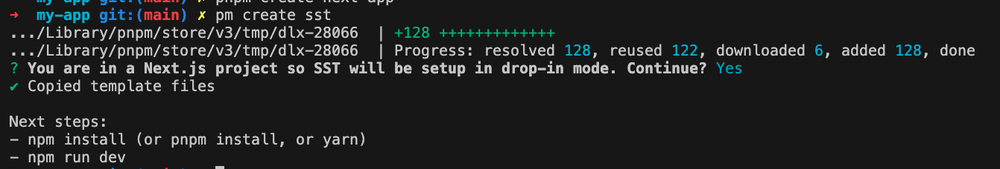
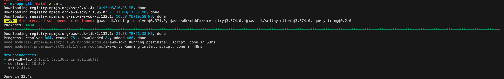
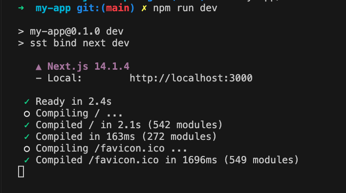
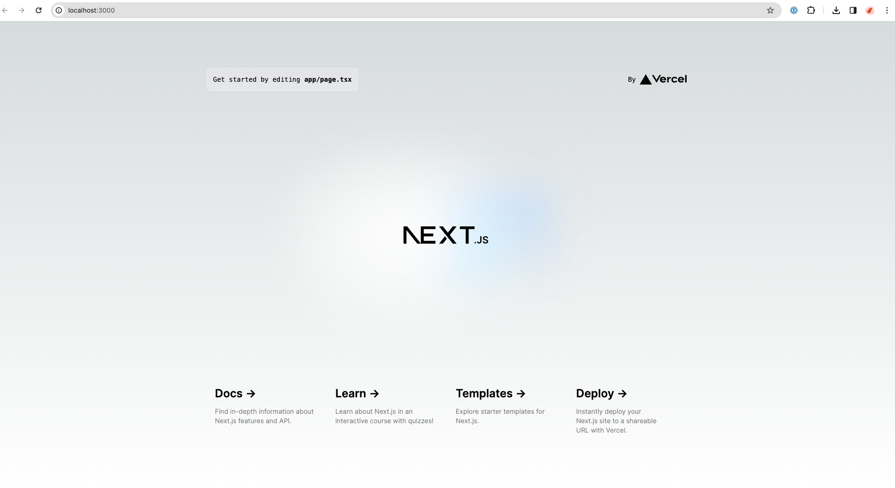

# sst-nextjs-example

https://docs.sst.dev/start/nextjs


## Creating a nextjs app using sst vs2

https://docs.sst.dev/start/nextjs

```bash
npx create next-app
```



```bash
cd my-app
pnpm create sst
```



```bash
pnpm install
```



```bash
pnpm sst dev
```

Open a new terminal and run:

```bash
pnpm run dev
```




